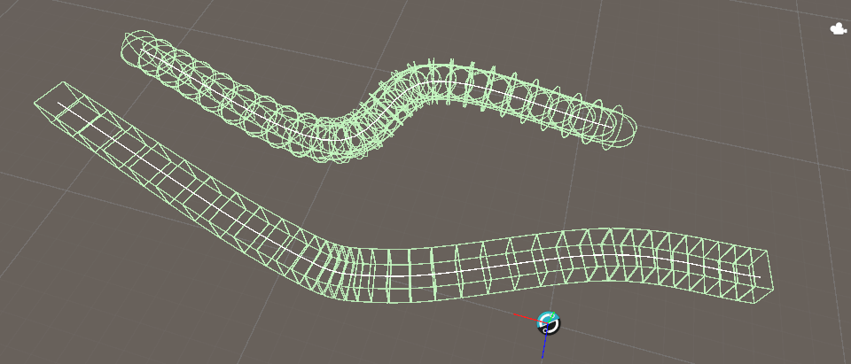

# 3D Collision

**Dreamteck Splines 3.0.6** introduces two new Spline User components for generating compound colliders - the Box Collider Generator and the Capsule Collider Generator. 
These two components create child objects with the respective type of collider, and manage them to produce a continuous object. They are suitable for generating invisible walls or to create optimized collision for existing objects. 

