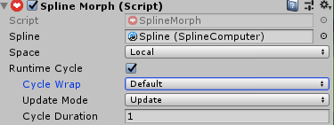

# Morphing Splines
Dreamteck Splines provides easy morphing functionality which allows different spline shapes to be blended into each other. In order for this to work, all versions of the spline should have exactly the same point count.

To use spline morphing, add the Spline Morph component to a Spline Computer object. Inside the inspector of the Spline Morph component, there is a “+” button with a text box next to it. Clicking the button will add the first morph channel.

The first morph channel is the base channel and holds the original spline shape. Each channel that is added afterwards will have a blend slider which controls how much the shape in this channel is morphed towards.

In order to blend between two spline shapes, create a base channel.

 

After this, re-arrange the points of the spline and click the Create channel button again. A new morph channel will be created that holds the new shape.

 

With that new channel created, the two shapes can now be blended between by pulling the slider of the second channel left and right. 

Each channel can interpolate the spline points linearly or spherically – this is set using the Interpolation property. The curve property controls the blend interpolation rate.

To edit a channel’s points, edit the spline points and click the channel record button: 

## Runtime Cycle
The morph component can automatically cycle through its states during runtime if “Runtime Cycle” is checked. Doing so will expose three additional parameters:

- Cycle wrap
- Update Mode
- Cycle Duration

Cycle wrap defines what happens when the morph cycle ends. Default mode will simply stop at the last channel. Loop will start again from the first channel and Ping Pong will play the morph cycle backwards.

Update mode defines the update cycle in which the logic will be performed – Update, LateUpdate or FixedUpdate

Cycle duration is the time the cycle needs in order to run A to Z.