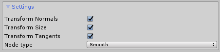

# Nodes
Nodes are a key feature and serve two very important purposes - to bind points of Spline Computers to other scene objects and to create junctions. 


To create a Node, go to **GameObject/3D Object/Spline Node**. This will create a new Game Object with a Node component in the scene.

Another way to create a Node is just by adding a Node component to an existing object.

The newly created node will be empty and will require a connection to be added. To add a connection, drag a Game Object with a Spline Computer from the scene into the Connections box.


When a Spline Computer is dragged in, its points will visualize as circles and a point dropdown menu will be shown in the inspector. 


The Node will now require a point from the Spline Computer to be selected. To select a point either select it from the dropdown menu and click “Link” or click on a point in the scene view. If the point has no connections added, after the first point is selected, a dialog will appear asking what to do when connecting:


- Snap and Align – Will move the Node to the selected point and will rotate the node along the spline
- Snap – Will just move the node to the selected point’s position
- No – Will move the selected point to the node

After the node has been connected, its Transform can then be animated or a Rigidbody can be attached and when the Node moves, the connected point will also be updated.

A Node can have more than one Spline Computer connected to it. Repeat the procedure with another Spline Computer to add a new connection.


When editing a point that is connected to a Node in the Spline Editor, the node’s position will also be updated and therefore all the other Spline Computers connected to it.

If the connected spline is of Bezier type, a “Swap Tangents” button will be available next to the spline’s entry in the connections list. Pressing it will change the direction of the connected point’s tangents.


To remove a spline connection, click on the “x” button inside the connections list panel.

Clicking the “Select” button will select the connected spline’s Game Object in the scene.
## Node Settings
Expanding the Settings panel inside the Node’s inspector will reveal additional options that apply for the entire node:



- Transform Normals – Should point normals be transformed when the Node rotates?
- Transform Size – should point sizes be transformed when the Node is scaled?
- Transform Tangents – should Bezier tangents be transformed by the Node’s rotation?
- Node Type – Smooth will apply the same point properties to all connected points (size, color, normals, tangents) so that all points, connected to the Node are the same. Free will preserve the points’ properties and only sync position.


## Junctions
When two Spline Computers are connected to the same Node, this is considered a junction since getting the connection list of a Node provides all the information, needed to know in order to switch to another spline.


Junctions are used entirely through code. The Spline Tracer components provide a convenient API for handling junctions.

This example script can be attached to either a Spline Positioner, Follower or a Projector and will work for bopth of them:

```csharp
using System.Collections.Generic;
using UnityEngine;
using Dreamteck.Splines;

public class ExampleJunctionHandler : MonoBehaviour
{
    SplineTracer tracer;

    private void Awake()
    {
        tracer = GetComponent();
    }

    private void OnEnable()
    {
        tracer.onNode += OnNode; //onNode is called every time the tracer passes by a Node
    }

    private void OnDisable()
    {
        tracer.onNode -= OnNode;
    }

    private void OnNode(List<SplineTracer.NodeConnection> passed)
    {
        //plineTracer.NodeConnection holds information about the point index and provides a direct reference to the Node
        //a list of Node connections is passed in case the tracer has moved over several points in the last frame
        //this happens very rarely in particular cases where points are very close to each other and the tracer moves very fast

        Debug.Log("Reached node " + passed[0].node.name + " connected at point " + passed[0].point);

        //Get all available connected splines

        Node.Connection[] connections = passed[0].node.GetConnections();

        //If this node does not have other connected splines, skip everything - there is no junction

        if (connections.Length == 1) return;

        //get the connected splines and find the index of the tracer's current spline

        int currentConnection = 0;

        for (int i = 0; i < connections.Length; i++)
        {
            if (connections[i].spline == tracer.spline && connections[i].pointIndex == passed[0].point)
            {
                currentConnection = i;

                break;
            }
        }

        //Choose a random connection to use that is not the current one
        //This part can be replaced with any other Junction-picking logic (see TrainEngine.cs in Examples)
        int newConnection = Random.Range(0, connections.Length);

        //If the random index corrensponds to the current connection, change it so that it points to another connection
        if (newConnection == currentConnection)
        {
            newConnection++;

            if (newConnection >= connections.Length) newConnection = 0;
        }

        //A good method to use which takes into account spline directions and travel distances
        //and adds compensation so that no twitching occurs

        SwitchSpline(connections[currentConnection], connections[newConnection]);
    }

    void SwitchSpline(Node.Connection from, Node.Connection to)
    {
        //See how much units we have travelled past that Node in the last frame
        float excessDistance = tracer.spline.CalculateLength(tracer.spline.GetPointPercent(from.pointIndex), tracer.UnclipPercent(tracer.result.percent));

        //Set the spline to the tracer
        tracer.spline = to.spline;
        tracer.RebuildImmediate();

        //Get the location of the junction point in percent along the new spline
        double startpercent = tracer.ClipPercent(to.spline.GetPointPercent(to.pointIndex));

        if (Vector3.Dot(from.spline.Evaluate(from.pointIndex).forward, to.spline.Evaluate(to.pointIndex).forward) < 0f)
        {
            if (tracer.direction == Spline.Direction.Forward) tracer.direction = Spline.Direction.Backward;
            else tracer.direction = Spline.Direction.Forward;
        }

        //Position the tracer at the new location and travel excessDistance along the new spline

        tracer.SetPercent(tracer.Travel(startpercent, excessDistance, tracer.direction));
    }
}
```

If it seems very complicated, here are simplified versions of both the OnNode and SwitchSpline methods:

```csharp
private void OnNode(List<SplineTracer.NodeConnection> passed)
{
    Debug.Log("Reached node " + passed[0].node.name + " connected at point " + passed[0].point);
    Node.Connection[] connections = passed[0].node.GetConnections();

    if (connections.Length == 1) return;

    int newConnection = Random.Range(0, connections.Length);

    if (connections[newConnection].spline == tracer.spline && connections[newConnection].pointIndex == passed[0].point)
    {
        newConnection++;

        if (newConnection >= connections.Length) newConnection = 0;
    }

    SwitchSplineSimple(connections[newConnection]);
}

void SwitchSpline(Node.Connection to)
{
    tracer.spline = to.spline;
    tracer.RebuildImmediate();
    double startpercent = tracer.ClipPercent(to.spline.GetPointPercent(to.pointIndex));
    tracer.SetPercent(startpercent);
}
```

To summarize – what needs to happen inside OnNode is:

- We need to get the connections of the reached node
- We need to find a new, suitable connection which to use
- We then assign the spline from the new connection to the tracer and set the Tracer’s position along the new spline to the position of the connected point (via spline.GetPointPercent tracer.SetPercent)

Junction picking can be aided with additional, custom components. For example, an additional component that is attached to the Node object which says which connections can be used. An example for this can be found inside the Train example scene. There, a component called “Junction Switch” is used to do exactly this and the logic for junction picking and switching can be found inside TrainEngine.cs where inside OnNode, a reference to the JunctionSwitch is used in order to pick the right connections.