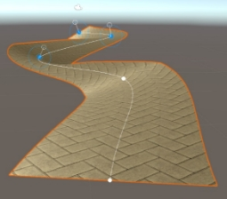
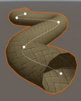
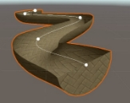
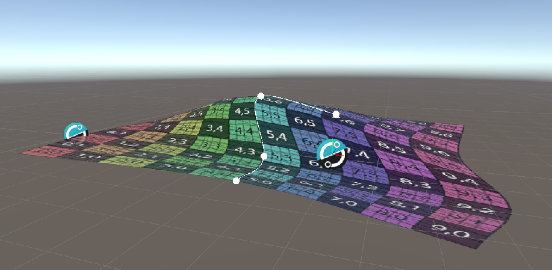
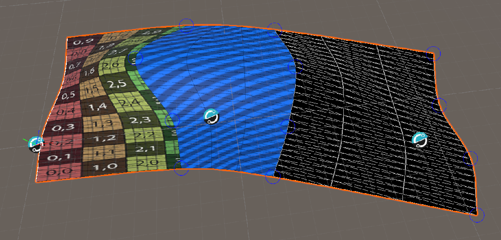
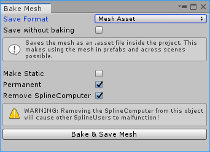

# Spline Mesh Generation
The Mesh Generators are a special kind of Spline User class, dedicated to generating mesh geometry using a spline. The Mesh Generator component by itself doesn’t do anything but is used as a base for creating other components. It provides basic properties, functionality and pipeline which are needed for the generation of meshes. It comes with its own custom editor which extends the SplineUser editor.

The MeshGeneration properties and functions are:

- Calc. Tangents: If checked, tangents will be calculated for normal mapping
- Size: The size of the generated geometry’s circumference around the spline.
- Color: A color multiplier for the vertices
- Normal Method: the method used for the vertex normal calculation
- Offset: A Vector3 offset direction local to the spline.
- Rotation: Rotation in degrees around the spline
- Double-sided: If checked, the generated mesh will be double-sided
- Flip faces: If checked, the generated mesh will have flipped faces
- Info & Components: a foldout with information about the mesh and the mesh components
- Bake mesh button: Button used for mesh baking (See [Baking Mesh Generators](#baking-mesh-generators))

Each MeshGenerator’s behavior is affected by the spline points’ colors and most of them are affected by the points’ sizes.

## Collision Generation
If a Mesh Collider component is present, the Mesh Generator will offer to update it when geometry is generated. Since updating mesh colliders is a heavy task, when a Mesh Collider is present an additional value will be exposed in the inspector. This value is called “Collider Update Interval” and defines how frequently the mesh collider will be updated.

Setting this value to 0 will cause the Mesh Collider to update as soon as there is a change in the mesh. Note that the Mesh Collider will not update if there aren’t changes in the mesh.

If multithreading is enabled, the mesh generation algorithm will be executed on another thread. However, due to the thread-unsafe nature Unity’s API, mesh writing, collider updates and optimization are done on the main thread.

**Note: All mesh generators can generate a mesh with up to 64 000 vertices since this is the maximum vertex count per mesh supported by Unity. If the vertex limit is exceeded for the generated mesh, an error message will appear in the console and the mesh will stop updating.**
## Spline Mesh
This is a universal component for extruding and placing meshes along a spline. It produces a single mesh which can have multiple material IDs.

The Spline Mesh component contains channels which contain meshes. Each channel is computed independently which makes it possible for complex meshes with lots of different elements to be composed.

As soon as a channel has a single mesh assigned to it, the mesh will be extruded along the spline. Adding more meshes will cause the channel to iterate through them in the order of adding. It is possible to randomize the iteration by checking the “Random Order” checkbox. Note that when more than one meshes are added to a channel, they will not appear unless the channel’s mesh count (to the right) is set to at least the number of the meshes.

There are two types of channels:

- Extrude – deforms the meshes along the spline
- Place – places the meshes along the spline without deforming

Each channel has its own clip range which defines the spline region it is going to take up.

When a mesh is added to a channel, it can be edited prior to the generation. This helps for correcting pivot orientations, unwanted offsets or sizes.  To configure a mesh, click on it in the Channel tab – it will open the Configure mesh window:

It is also possible to use a custom handler function for controlling the offset, rotation and scale along the extrusion. This can be used for some interesting effects and deformations (see API Reference).
## Spline Renderer

The Spline Renderer is an analogue of Unity’s Built-in Line renderer. It uses a spline to visualize instead of a set of points. It’s the first of a set of behaviors, derived from a special Spline User class called MeshGenerator. This class is used to provide basic functionality for creating procedural geometry using a spline. 

The generated geometry will be oriented towards the camera on each render cycle meaning that this mesh is constantly updated and therefore bigger meshes might cost performance.

Because of the triangular nature of the mesh, in some cases the texture coordinates of the Spline Renderer might appear jagged.

This is most often observed when there are spline points with different sizes and the solution to this is to add more edge loops. To do so go to the inspector and increase the number of Slices:

This will reduce the jagged artefacts. The same applies for the Path Generator component.

The Spline Renderer component is the only mesh generator which does not update Mesh Colliders.
## Path Generator

The Path Generator is very similar to the Spline Renderer with a few exceptions. First, unlike the Spline Renderer, the Path Generator does not orientate the generated geometry to face the camera. Instead the geometry is orientated in the direction of the spline normal.

Like the Spline Renderer, the Path Generator has the option for multiple edge loops (called Slices) to prevent jagged texture coordinates. However, the Path Generator’s slices also serve a function of deforming the generated path. Turning on the “Use Shape Curve” option will expose a curve editor. If the slices of the Path Generator are set to a value bigger than 1, then the path can be deformed using the curve editor.

## Tube Generator

The Tube Generator is useful for creating geometry, revolving around a spline like cables and tubes. It generates a hollow mesh which can have caps at both ends. 

The type of caps is defined by the Cap property:

- Flat
- Round

The Revolve property [0-360] controls the spin of the generated tube around the spline. If less than 360, the Tube Generator will generate open geometry.

## Surface Generator

The Surface Generator creates a 3D surface from a spline. These surfaces can be used for creating different kinds of platforms, natural water pools, shape animations etc. They don’t require the spline to be closed to work. 

By default, the generated surfaces don’t have thickness which may not look good in some situations. To add thickness to the surface, increase the “Extrude” value in the inspector.

If Extrude is different than zero, a secondary set of UV coordinates which control the side UVs will be exposed in the inspector.

Surfaces can also be extruded along another spline. Drag the SplineComputer component of the extrusion spline in the “Extrude Path” field in the Inspector:

## Multi Spline Surface Generator

The Multi Spline Surface Generator creates a terrain-like mesh from multiple splines. The generated mesh spans across the splines to give a high level of control. 
For this tool to work, there needs to be at least one additional spline linked. This can happen manually by selecting it through the Other Splines array or by clicking the "Add Spline" button which will generate a new spline and automatically link it to the generator.

To edit the surface, either edit the splines separately or use the circular gizmos that appear once the Multi Spline Surface Generator is selected. 

To control the resolution of the mesh along the splines, change the sample rate of the main spline (the one primarily linked in the "Spline" property of the generator). To control the resolution of the mesh in-between the splines, change the "Subdivisions" property of the generator.

The Multi Spline Surface Generator supports different material IDs per segment. Enable that by toggling "Separate Material IDs" in the inspector. This will make part of the mesh disappear. To fix that, add as many materials as there are other splines to the Mesh Renderer component.

## Baking Mesh Generators
Each Mesh Generator component can be baked into a static mesh with lightmap UVs. To do that, click the “Bake Mesh” button at the bottom of the Mesh Generator’s inspector. This will open the Bake Mesh window.

The Bake Mesh window provides a range of settings for baking and a Bake button. 

- Save Format – In what format to save the mesh?
  - Mesh Asset – Will save the mesh as a Unity .asset file in the project. This creates a full-featured Unity mesh asset
  - OBJ – Will save the mesh as an open source OBJ file which can be edited in modeling programs. Some vertex properties like color are not supported.
- Make static – will make the object static when bake is finished.
- Permanent – will remove the Mesh Generator component. Usually it’s best to leave this unchecked.
- Remove SplineComputer - will remove the Spline Computer component that is referenced by the Mesh Generator
