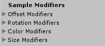
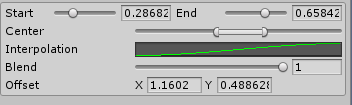

# Sample Modifiers

Inside the Inspector of all Spline User component, there is a section for the so-called Sample Modifiers. These are operations that are performed on the spline samples before the given user uses them. This way, it is possible to add custom offsets and change the spline output per user.

All modifiers work in the same way – they just modify different values of the spline samples. When a modifier foldout is expanded, there are always these UI elements:

- Draw All Modules – will draw all modules from the given group in the scene view regardless of whether they are selected.
- Blend – a general multiplier that applies to all modules under the given group. Moving the value towards zero will decrease the effect of all modules in the group.
- Add New ### - The “Add New” button will add a new module inside the given group.

When a module is selected, it is drawn in the scene view and int can be edited there directly. The two bigger handles define the range where this modifier works. The smaller handles define the area of full strength (between the small handles).

Pressing Ctrl will display an additional handle in the middle which when dragged, moved all handles together along the spline.
## Offset Modifiers
The offset modifiers apply offset to the spline samples. **The offset is always local to the spline**.

The offset is defined by either directly dragging the offset handle in the scene (the small circle) or through the inspector’s offset property.
## Rotation Modifiers
The rotation modifiers modify the direction and normal vectors of the spline samples so that different rotation can be computed. This works especially well with Spline Tracers:

The rotation offset vector is local to the spline and can be edited either by using the rotation handle in the scene or by modifying the rotation field of the modifier inside the inspector.

The rotation modifiers can use a specific look target (a Transform in the scene) instead of a rotation offset property. When a look target is used, the rotation offset will be computed in such a way that the rotation will point towards the target. 

## Color Modifiers
The color modifiers offset the color of the spline samples:

There are four blending modes that can be used for this operation:

- Lerp
- Multiply
- Add
- Subtract

## Size Modifiers
The size modifiers change the size of the spline samples. If the value is positive, size will be added to the spline and if the value is negative, size will be subtracted from the spline samples.

